# Credit_Risk_Analysis

## Overview
The purpose of this analysis is to use machine learning models to predict credit risk.

## Results
Using bulleted lists, describe the balanced accuracy scores and the precision and recall scores of all six machine learning models. Use screenshots of your outputs to support your results.
   - Naive Random Oversampling
     - 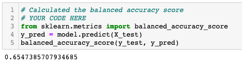
     - When using the Naive Random Oversampling algorithm, we had a balanced accuracy score of .6547 or 65.47%. 
     - 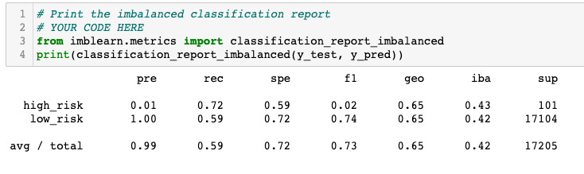
     - The overall precision score for this algorithm is very high at 99% but when looking at the precision for predicting high-risk loans specifically, the precision is only 1% vs. 100% for predicting low-risk. The overall recall is lower at 59%, with a 72% recall score for high-risk loans and a 59% recall score for low-risk.
   - SMOTE Oversampling
     - 
     - When using the SMOTE Oversampling algorithm, we get a balanced accuracy score of 66.2%.
     - 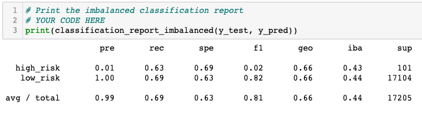
     - Again we see a very high precision score of 99% but only 1% for high-risk and 100% for low-risk loans. The overall recall score of the algorithm is 69%, with a 63% recall score for high-risk and a 69% recall score for low-risk.
   - Undersampling
     - 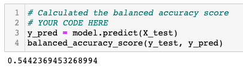
     - When using the Undersampling algorithm, we get a balanced accuracy score of 54.4%. 
     - 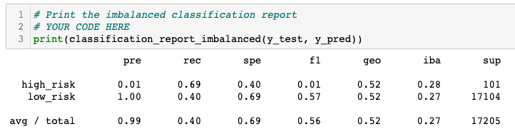
     - The overall precision score for this algorithm is very high 99% but 1% for high-risk and 100% for low-risk loans. The recall score is low at 40%, with a 69% recall score for high-risk loans and 40% for low-risk.
   - Combination Sampling (SMOTEENN)
     - 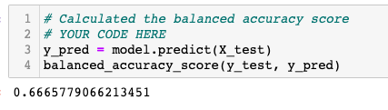
     - When using the SMOTEENN algorithm, we had a balanced accuracy score of 66.6%
     - 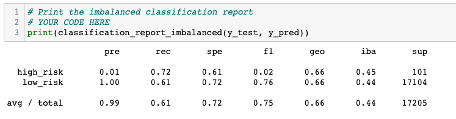
     - The overall precision score is very high at 99%, with 1% precision score for high-risk and 100% for low-risk loans. The recall score is 61%, with 72% recall score for high-risk and 61% for low-risk. 
   - Balanced Random Forest Classifier
     - 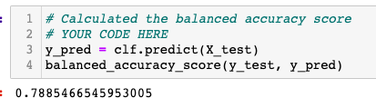
     - When using the Balanced Random Forest Classifier we had a balanced accuracy score of 78.9%. 
     - 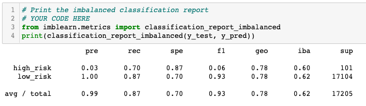
     - The overall precision score for this algorithm is very high at 99%, with 3% precision score for high-risk loans and 100% for low-risk. The overall recall score is also high at 87%, with a 70% recall score for high-risk and 87% for low-risk. 
   - Easy Ensemble AdaBoost Classifier
     - 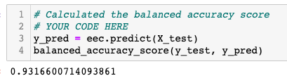
     - When using the Easy Ensemble AdaBoost Classifier we had a balanced accuracy score of 93.2%
     - 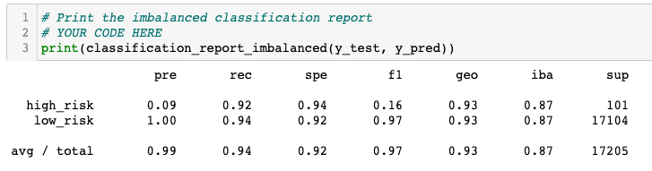
     - The overall precision score for this algorithm is very high at 99%, with 9% precision score for high-risk loans and 100% for low-risk. The overall recall score is also very high at 94%, with a 92% recall score for high-risk and 94% for low-risk. 

## Summary
Summarize the results of the machine learning models, and include a recommendation on the model to use, if any. If you do not recommend any of the models, justify your reasoning.

This tells us that the algorithm is predicting almost all loans as low-risk so the predicted positives are likely true positives but a number of other true positives may not have been predicted using this algorithm. 

